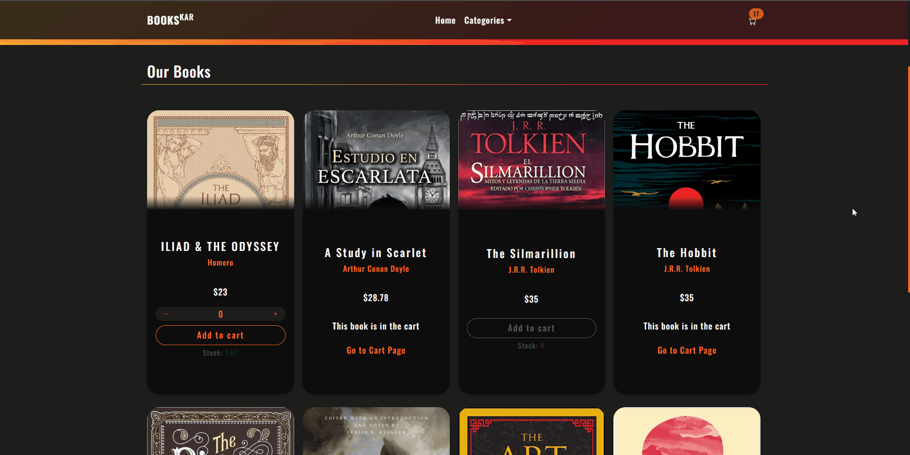

# Store 🛍️

_El STORE esta desarrollado con React.js (v18.1.0)_

Este ecommerce se especializa en la venta de libros y fue realizado como ejercicio para la practica profesional. Me gustaria en un futuro cambiar ciertas funciones usadas en el context y probarlas con Redux, asi como tambien integrar librerias como por ejemplo, para geolocalizacion y mostrar ofertas dependiendo del pais donde se visita el sitio, integrar modales para mostrar promociones, suscripcion a newsletter, etc. Asi como tambien Unit Testing con Jest por ejemplo.

## Comenzando 🚀

_Estas instrucciones te permitirán obtener una copia del proyecto en funcionamiento en tu máquina local para propósitos de desarrollo y pruebas._

### Pre-requisitos 📋

_Que cosas necesitas para instalar la app y como instalarlas_

```bash
yarn install or npm install
```

_\*Si no tienes YARN_

```bash
npm install --global yarn
```

### Ejecutando versión Develop 🔧

_Ejecutar este comando para tener un entorno de desarrollo ejecutandose_

```bash
yarn start or npm start
```

_Y corre en el navegador [http://localhost:3000](http://localhost:3000)_

## Despliegue 📦

La SPA esta alojada en FIREBASE.

- [books-store](https://bookstore-89cc9.web.app)

## Demo 🖥️

### Agregando productos al carrito


### Checkout



## Construido con 🛠️

_Herramientas que utilice_

- [React.js](https://nextjs.org/) - El framework web usado
- [React Router Dom](https://reactrouter.com/) - Libreria para manejar las rutas del proyecto.
- [Css](https://getbootstrap.com/) - Librería Bootstrap.
- [Webpack](https://rometools.github.io/rome/) - Manejador de dependencias
- [Eslint](https://eslint.org/) - Herramienta para "limpiar" código javascript
- [Prettier](https://prettier.io/) - Formateador automáticamente de código
- [Firebase](https://firebase.google.com/) - Base de datos y alojamiento del sitio.
- [React hook form](https://react-hook-form.com/) - Para la validacion de los formularios.

---
